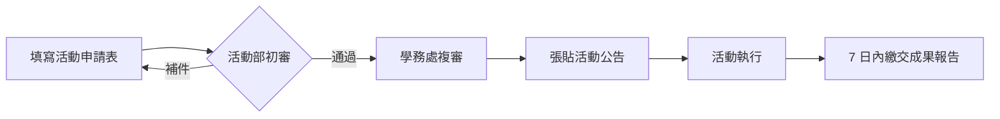

[TOC]

## 一、總則

為輔導社團健全發展、規範社團活動之申請與執行，特訂定本要點。

**適用範圍**：本校所有已立案之學生社團及其舉辦之校內外活動。

## 二、活動申請

### （一）申請時限

| 活動類型 | 應於幾日前提出 | 審核單位 |
| -------- | -------------- | -------- |
| 校內例行聚會 | 3 個上學日 | 學生會活動部 |
| 校內大型活動[^big] | 14 個上學日 | 學務處 + 學生會 |
| 校外活動 | 21 個上學日 | 學務處 |

[^big]: 指預計參與人數達 50 人以上，或需借用體育館、演藝廳等大型場地之活動。

### （二）申請流程

## 三、場地使用

1. 場地借用應依《場地管理辦法》辦理，並遵守先申請先使用原則
2. 使用後應恢復原狀，並於當日歸還鑰匙
3. 因可歸責於社團之事由損壞場地設備者，由該社團負賠償責任

:::info
💡 禮堂、體育館等熱門場地建議 **提前一個月** 提出申請，期中期末考週原則上不開放借用以維持安寧。
:::

## 四、經費補助

學生會每學期編列社團活動補助預算，補助原則如下：

- 以「活動性質」分級給付：學術型最高 3,000 元、服務型最高 5,000 元、聯誼型最高 1,500 元
- 同一社團每學期以申請 **2 次** 為限
- 申請時應檢附經費預算表，活動後檢據核銷

:::spoiler 成果報告要寫哪些內容？
至少包含：活動照片 3 張以上、實際參與人數、經費收支明細、活動反思與下次改善方向。格式不拘，PDF 或紙本皆可，於活動結束後 **7 日內** 繳交至學生會活動部。
:::

## 五、附則

本要點未盡事宜，依學校相關規定辦理；修正後公布施行。
