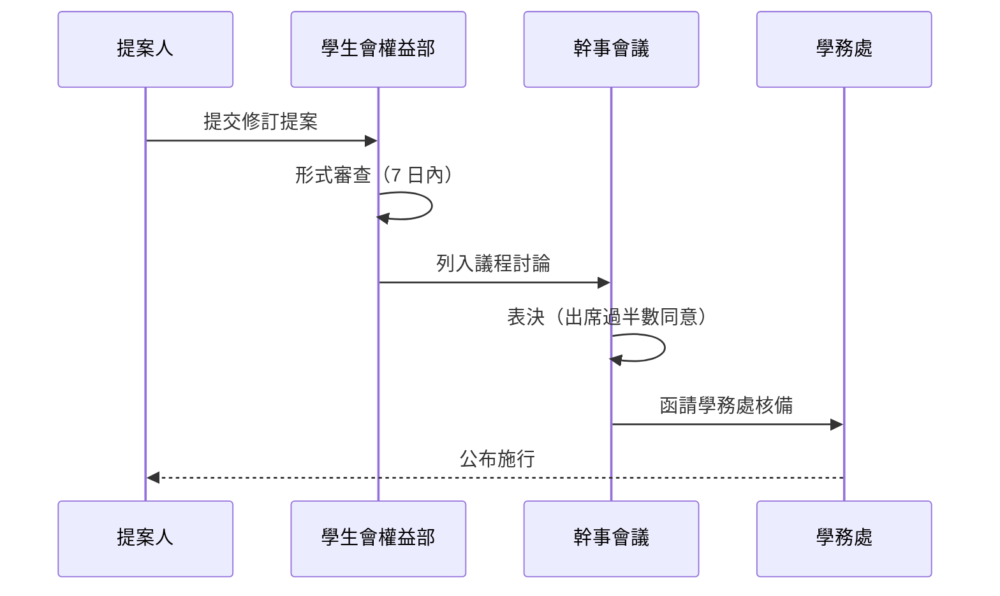

[TOC]

## 一、修訂提案

凡本校在學學生均得提出法規修訂提案。提案應載明：

1. 修訂之法規名稱
2. 擬修訂之條文與修正理由
3. 提案人姓名與班級

提案可透過學生會權益部意見箱或線上表單提出。

## 二、審議流程

## 三、公布與生效

:::warning
法規自公布之日起算 **第 3 日** 發生效力；但有特定施行日期或溯及既往之必要者，應於公布時一併載明。
:::

所有現行法規均公告於本系統，並標示 **revision（最後修訂日期）** 供同學查閱。若你發現線上版本與公告版本不一致，請立即回報學生會行政部 :pray:

> [!TIP]
> 訂閱本頁面所屬分類的更新通知，即可在法規修訂時收到提醒（規劃中）。
